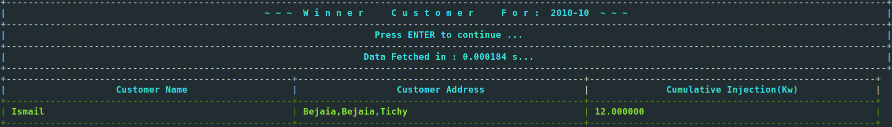

# DSA-ECMS

## 1. Project Description : 
<b>ECMS</b> is a  <span style="font-style:italic;">Data Structures and Algorithms II Module Project</span> , It is a <span>console application</span> system designed to <b>manage electricity billing</b> and <b>annual departments performances measured by their income</b>.

## 2.Requirements :
1. <b><span style="font-style:italic;">C++17 or higher with compatible G++ compiler.
2. Linux or other UNIX-like systems.
3. Python 3.x with matplotlib installed.
## 3. Usage :

1. Clone the repository locally :

```
git clone https://github.com/ziyad0081/DSA-ECMS-AVL.git
```

- Or download and extract its zipfile.

2. Build the binaries using makefile :

```
cd \Directory\to\repository\root && make
```

3. Run the built binary `ECMS`:

```
cd Bin && ./ECMS
```

## 4. Contribution :
- This is a small project lacking various features and in dire need of refactoring.
- Contributors are welcome to add more algorithms, improve code quality, fix bugs, or even restructuring when needed !
- `clone` the repository, `branch` out for your feature and submit a `pull` request !


## 5. Acknowledgements :

The following libraries were indispensable and greatly contributed to the realization of this project.
 1. **Tabulate :**
 - Github Repository : [Tabulate](https://github.com/p-ranav/tabulate)
 - Description : Console table creation library for modern C++.
 2. **Conio.h For Linux :**
 - Github Repository : [Conio.h](https://github.com/zoelabbb/conio.h)
 - Description : An open-source port to the infamous windows `conio.h` library for linux.

## 6. Screenshots:
- Main Menu:


- Some screens :



